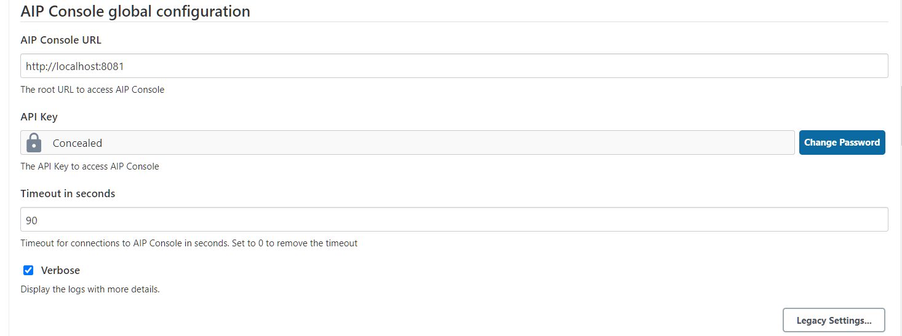
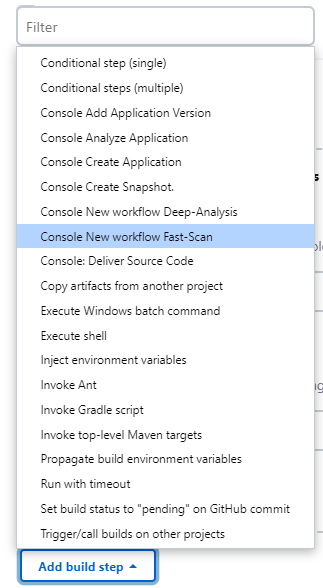
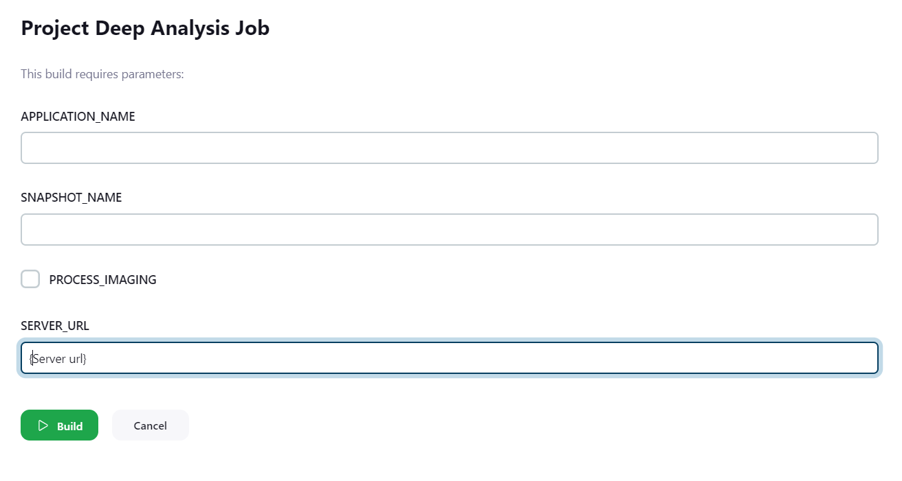
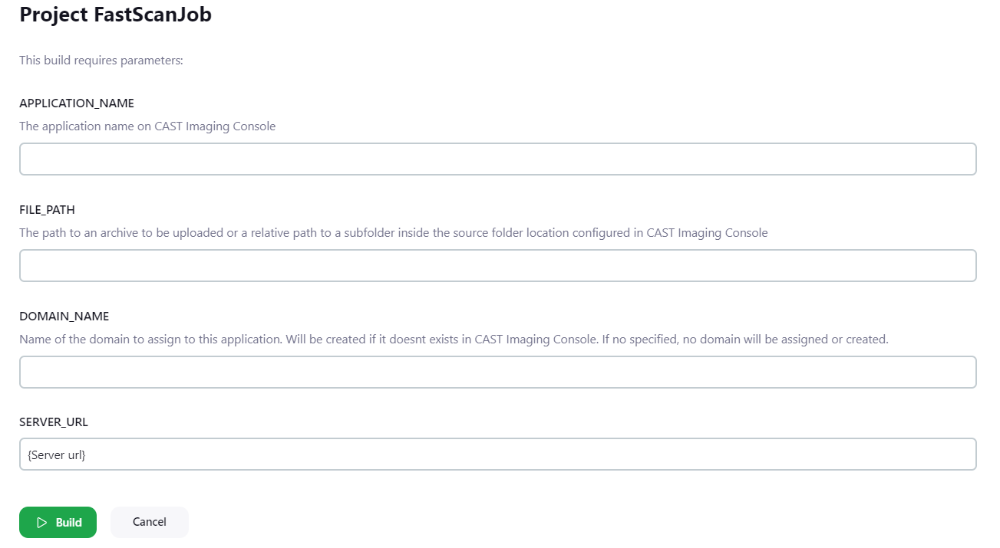
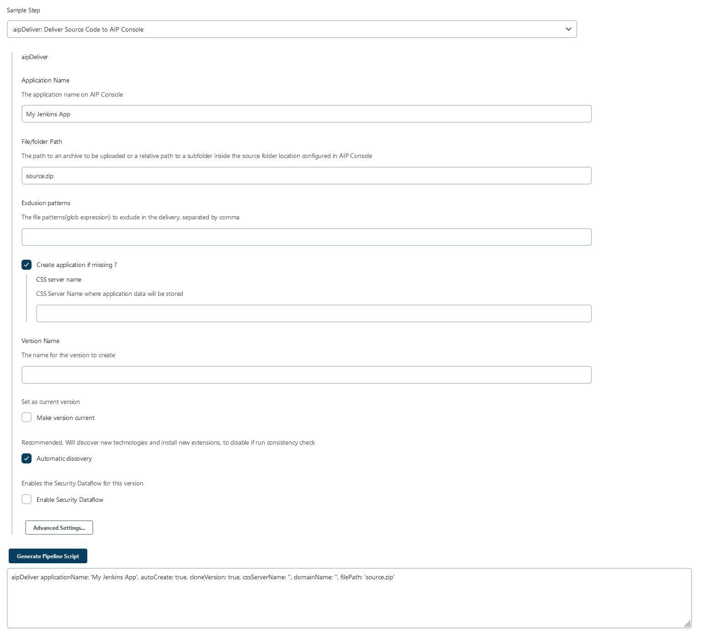
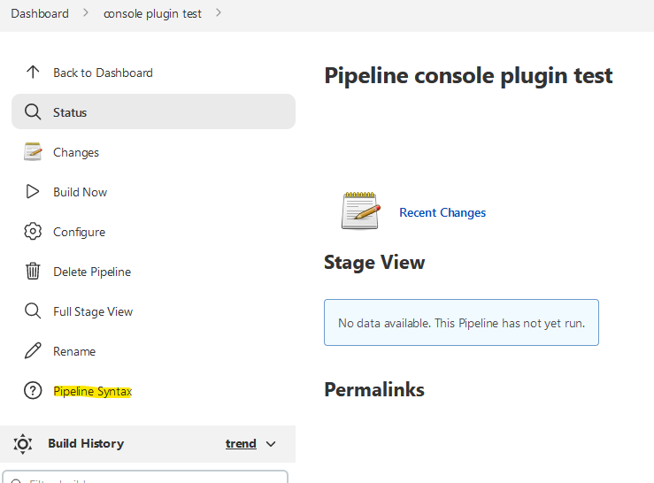
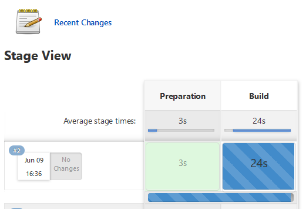

## AIP Console Tools Jenkins Plugin

This Jenkins Plugin for AIP Console allows users to automate application source code delivery and analysis directly within their CI systems. Most elements that can be configured through the AIP Console UI can also be configured when using this plugin in your build configurations.

### Pre-Requisites

This plugin requires the following :

* Jenkins version 2.60.3 or above
* An installation of AIP Console 2.X that is accessible and configured.
* A means of Authentication using :
  * For Enterprise installations, an API Token for the user that will run the CLI (
    check [here for details on obtaining a token](https://doc.castsoftware.com/display/AIPCONSOLE/AIP+Console+-+User+Profile+options))
  * For AIP Console Standalone, a username and password. Check the `Authentication with username (AIP Console Standalone)` section in Other Topics, towards the end of this document.
* The ability to generate an archive for your source code OR a configured location in AIP Console where your source will be stored/updated.

### Installation (and Update)

To start using AIP Console Jenkins Plugin, you must first install the plugin in Jenkins.

To do this, you must go to Manage Plugins page of your Jenkins Server.


Then, in the "Advanced" tab, under "Upload Plugin", click "Browse" and select the `aip-console-jenkins.hpi` file.

Click on Upload and Jenkins should install the plugin.

**Updating the plugin is the same process**, but it might require to restart your Jenkins server after installation for the changes to take effect.

### Configuration

To configure the AIP Console plugin, go to the "Configure System" page in the "Manage Jenkins" page.


On this page, go to the **AIP Console global configuration** section and enter the following required elements :

* *AIP Console URL* : The URL to access the AIP Console server. Make sure that this address is accessible from the
  Jenkins Server and the Jenkins Node that might run the plugin as well.
* *API Key* : The API key that will be used to authenticate to AIP Console.
* *Timeout* : A global timeout setting in seconds before calls to AIP Console will be considered in error.
* *verbose* : When checked, the AIP Console logs will also be displayed on the build's log. Uncheck this to prevent displaying the entirety of the AIP Console job execution to be displayed during the build.



### Using different AIP Console URL and API Key

Should you require to target a specific AIP Node instance that differs from the global configuration in Jenkins, you can specify the URL and an API Key by opening the "Advanced Settings" options. Note that you will have to manually set them for each build steps that require targeting a specific AIP Console Instance.


The AIP Console URL and associated API Key specified in the step details will always be used when running a step. In case they are left empty, the global configuration will be used instead.

## Quick Start

The following section will focus on running a job, with the basic required parameters. For more details on each options, please refer to each steps in [Advanced Usage](#advanced_usage)

#### Create Application

To create an application, add the `Create application on AIP Console` Step to a job.


In that build step :
* you *must* provide the application name.
* You can decide whether the application should keep the delivered version history or not.

Running this step will create the application and initialize the underlying systems in AIP Console.

<u>Important note</u>
* When an application is created without the delivery history then the source code should be located in the Source
  Folder Path sub-folders. This meant no file will not be accepted.
  
#### Add Version


The `Add Application Version to AIP Console` will create a new version of an application, run an analysis and create a
snapshot of that analysis.
  
This step requires the following :

* An application name for which a new version will be created. <u>This application must exist in AIP Console</u>.
* A path to a zip or tgz archive file to upload (**NOTE**: you can also provide a folder path; more details in the Advanced Usage Section below).

This step will perform the following actions :

* Upload the file `source.zip` to application `my app`
* Create a new version with an automatically generated name
* Run an analysis on this version
* Create a snapshot

This version and the snapshot can be found in the Application's page in AIP Console.

#### Deliver

The `Deliver Source Code to AIP Console` step is similar to the Add version step above.


It requires the following :

* An application name for which a new version will be created. <u>This application must exist in AIP Console</u>.
* A path to a zip or tgz archive file to upload (**NOTE**: you can also provide a folder path; more details in the
  Advanced Usage Section below).
* Whether the version should be current or not

This step will perform the following actions :

* Upload the file `source.zip` to application `my app`
* Create a new version with an automatically generated name

The version will be created and visible inside the `Versions` tab of the application in AIP Console.

#### Analyze

The step `Analyze Application on AIP Console` will only run an Application Analysis on AIP Console.

It only <u>requires an Application Name</u>.

However, note that you <u>need at least one Delivered version on AIP Console</u> for this step to work correctly.

This step will perform the following actions :

* Get the latest version
* Start an analysis on that version


#### Snapshot

The step `Create Snapshot on AIP Console` will create a snapshot for an Application on AIP Console.

It only <u>requires an Application Name</u>.

However, note that you need to have run an Analysis on the Current version for the target Application.

This step will perform the following actions :

* Create a Snapshot
* Generate Snapshot Indicators
* Publish snapshot
* Optionally decided whether to publish the application to the Health Dashboard or not.

The Snapshot can then be found inside the `Snapshot` tab in AIP Console.


#### Onboard Application

Creates an application or uses an existing application to manage source code using a modern on-boarding workflow in CAST
Imaging Console.

This command is used to perform the *Fast scan* or to *refresh* the sources contents before optionally perform a *Deep
Analysis* (run the
analysis).

- To perform *Fast Scan/New Scan* operation do select *Console Onboard Application Fast-Scan* step
- To perform *Deep Scan/Run Analysis* operation do select *Console Onboard Application Deep-Analysis* step

**build step**



***job configuration***



## Advanced Usage

This section will provide a detailed look at each parameter available for each type of jobs.

### A Note on variable expansion

Variable expansion means replacing some variables in text fields to an environment variable value.

For example, creating an application with name "${JOB_NAME} (jenkins)", the Plugin will replace '${JOB_NAME}' with the
name of the current running job.
You can use these environment variables on the following fields in each jobs (when defined):

* Application name
* Version name
* Snapshot name
* Domain Name
* Source File Path

You can manually add environment variables to a build or use global jenkins environment variables (see [the jenkins documentation](https://www.jenkins.io/doc/book/pipeline/jenkinsfile/#using-environment-variables))

### Create Application


The Create Application provides the following parameters :

* *Application name* (**required**): The name of the application that will be created in AIP Console
* *Node Name*: The name of the AIP Node on which the application will be created. If none is specified, AIP Console will pick a node.
* * *Domain Name*: The name of the domain to assign for the application.

Under `Advanced Settings` you will find the following parameters :


* *AIP Console URL*: URL to AIP Console should you want to target a different instance that the one specified in the global configuration.
* *API Key* : The API Key for the URL specified above.
* *CSS Server Name* : The URL to the CSS Server to use to store the application's data. Must have the format `host:port/dbName` as can be seen in the Admin Center, in Global Configurations under CSS and Measurement Settings
* *Connection Timeout*: Timeout in seconds for each calls to AIP Console.
* *Ignore Failure*: If checked, if an error occurs when running the step, the job will be marked `UNSTABLE` instead of `FAILED`. This allows running other steps after this one instead of failing the job immediately.

### Add Version


The Add Version step provides the following parameters :

* *Application Name* (**required**): The name of the application for which a new version will be created.
  * **NOTE**: Any environment variable specified in this field will be expanded. For example, `${BUILD_NUMBER}` will be replaced by the current jobs' build number.
* *File/Folder path* (**required**): The source code that will be used to create the new version. You can provide
  either :
  * A File path on the Jenkins Node where the job will be run to a ZIP, TGZ or TAR.GZ file
  * A Folder Path on the AIP Node relative to the Source Folder Path defined inside AIP Console. For more
    information, [please see here under Source Folder Location](https://doc.castsoftware.com/display/AIPCONSOLE/Administration+Center+-+Settings) **
    Requires AIP Console 1.15.0 or above**
  * **NOTE**: Any environment variable specified in this field will be expanded. For example, `${WORKSPACE}` will be
    replaced by the current jobs' workspace path.
* *Create Application if missing*: If checked and the application cannot be found on AIP Console, it will be created.
  * If checked, the option to specify a CSS server will appear. You can then specify which CSS server will store the
    application data. Format should ``host:port/dbName``. You can check the available CSS server in the Admin Section of
    AIP Console :
    

* *Version Name* (optional): The name of the version that will be created. If left blank, the version will be named with
  the following pattern : `vYYMMDD.hhmmss` based on date and time.
  * **NOTE**: Any environment variable specified in this field will be expanded. For example, `${BUILD_NUMBER}` will be
    replaced by the current jobs' build number.
* *Snapshot Name* (optional): The name of the snapshot that will be created, if left blank, the snapshot will be named
  with date and time
  * **NOTE**: Any environment variable specified in this field will be expanded. For example, `${BUILD_NUMBER}` will be
    replaced by the current jobs' build number.
* *Enable Security Dataflow*: Enables the Security Objective for this version. This setting will operate for both
  technologies JEE and DOTNET as well.<u>Has no effect if `Rescan` is checked</u>.
* *Module Generation Type*: How the module generation will be handled by AIP Console. Either "Full Content" (default), "
  Analysis Unit module" or "Technology Module".

Under `Advanced Settings` you will find the following parameters :


* *AIP Console URL*: URL to AIP Console should you want to target a different instance that the one specified in the global configuration.
* *API Key* : The API Key for the URL specified above.
* *Copy Configuration*: Copy the configuration of the previous version (also known as rescan). Enabled by default.
* *Blueprint Objective*: If checked, this will enable the Blueprint Objective during the application analysis.
* *Security Assessment*: If checked, this will enable the Security Assessment during the application analysis.
* *Enable backup*: Whether a Backup should be created before creating a new version. **Requires AIP Console 1.16.0 or above**
* *Name of the backup*: The name of the backup **if** Enabled Backup is checked. **Requires AIP Console 1.16.0 or above**
* *Publish to Imaging*: Publish to Imaging if Imaging is configured with AIP Console
* *Publish to Health Dashboard*: Publish to Health Dashboards after analysis. Enabled by default.
* *Ignore Analysis Failure*: If checked, if an error occurs when running the step, the job will be marked `UNSTABLE` instead of `FAILED`. This allows running other steps after this one instead of failing the job immediately.
* *Node Name* : The name of an AIP Node Instance on which the application will be created. If none is specified, AIP Console will pick a node. <u>Only used if `Create Application if missing` is Checked</u>
* *Domain Name*: The name of the domain to assign for the application. <u>Only used if `Create Application if missing` is Checked</u>
* *Connection Timeout*: Timeout in seconds for each calls to AIP Console.

### Deliver


The Deliver Source step provides similar parameters to the Add Version step :

* *Application Name* (**required**): The name of the application for which a new version will be created.
  * **NOTE**: Any environment variable specified in this field will be expanded. For example, `${BUILD_NUMBER}` will be replaced by the current jobs' build number.
* *File/Folder path* (**required**): The source code that will be used to create the new version. You can provide either :
  * A File path on the Jenkins Node where the job will be run to a ZIP, TGZ or TAR.GZ file
  * A Folder Path on the AIP Node relative to the Source Folder Path defined inside AIP Console. For more information, [please see here under Source Folder Location](https://doc.castsoftware.com/display/AIPCONSOLE/Administration+Center+-+Settings) **Requires AIP Console 1.15.0 or above**
  * **NOTE**: Any environment variable specified in this field will be expanded. For example, `${WORKSPACE}` will be replaced by the current jobs' workspace path.
* *Exclusion patterns* : List of file patterns to exclude in the delivery, separated by a comma. Each patterns needs to follow the syntax of [glob patterns](https://www.malikbrowne.com/blog/a-beginners-guide-glob-patterns)
* *Create Application if missing*: If checked and the application cannot be found on AIP Console, it will be created. Otherwise, the step will fail.
* *Version Name* (optional): The name of the version that will be created. If left blank, the version will be named with
  the following pattern : `vYYMMDD.hhmmss` based on date and time.
  * **NOTE**: Any environment variable specified in this field will be expanded. For example, `${BUILD_NUMBER}` will be
    replaced by the current jobs' build number.
* *Make version current*: When checked then the version is used as being the current, and it is made ready to
  analyze.
* *Automatic discovery* : If checked, it will enable to discovery of new technologies and install the associated extensions. It is advised to disable this if you want to keep every analysis to use the same set of extensions.
* *Copy configuration from previous version*: Clone the previous version of the application (similar to
  the `Same configuration as previous version` checkbox in the Add Version wizard of AIP Console). If unchecked or no
  version exists, it will run an Add version job instead.
* *Enable Security Dataflow*: Enables the Security Objective for this version. This setting will operate for both
  technologies JEE and DOTNET as well, and it will be ignored if `Rescan` is checked.

Under `Advanced Settings` you will find the following parameters :


* *AIP Console URL*: URL to AIP Console should you want to target a different instance that the one specified in the global configuration.
* *API Key* : The API Key for the URL specified above.
* *Copy Configuration*: Copy the configuration of the previous version (also known as rescan). Enabled by default.
* *Blueprint Objective*: If checked, this will enable the Blueprint Objective during the application analysis.
* *Security Assessment*: If checked, this will enable the Security Assessment during the application analysis.
* *Enable backup*: Whether a Backup should be created before creating a new version. **Requires AIP Console 1.16.0 or above**
* *Name of the backup*: The name of the backup **if** Enabled Backup is checked. **Requires AIP Console 1.16.0 or above**
* *Ignore Analysis Failure*: If checked, if an error occurs when running the step, the job will be marked `UNSTABLE` instead of `FAILED`. This allows running other steps after this one instead of failing the job immediately.
* *Node Name* : The name of an AIP Node Instance on which the application will be created. If none is specified, AIP Console will pick a node. <u>Only used if `Create Application if missing` is Checked</u>
* *Domain Name*: The name of the domain to assign for the application. <u>Only used if `Create Application if missing` is Checked</u>
* *Connection Timeout*: Timeout in seconds for each calls to AIP Console.

### Analyze

The Analyze step provides the following parameters :

* *Application Name* (**required**): The name of the application for which the analysis will be run.
* *Version Name*: The name of the version to Analyze. <u>If left blank</u>, the analyzed version will <u>be the latest Delivered Version</u>. If no new Delivered Version Exists, <u>it will use the Current Version</u>.
* *Snapshot*: Whether Snapshots should be created after Analysis.
* *Publish to Imaging*: Publish to Imaging if Imaging is configured with AIP Console
* *Publish to the Health Dashboard* : When checked, consolidates snapshots and publishes data to the Health Dashboards. Checked by default.
* *Module Generation Type*: How the module generation will be handled by AIP Console. Either "Full Content" (default), "Analysis Unit module" or "Technology Module".

Under `Advanced Settings` you will find the following parameters :


* *AIP Console URL*: URL to AIP Console should you want to target a different instance that the one specified in the global configuration.
* *API Key* : The API Key for the URL specified above.
* *Ignore Failure*: If checked, if an error occurs when running the step, the job will be marked `UNSTABLE` instead of `FAILED`. This allows running other steps after this one instead of failing the job immediately.
* *Connection Timeout*: Timeout in seconds for each calls to AIP Console.

### Snapshot


The Snapshot step provides the following parameters :

* *Application Name* (**required**): The name of tshe application for which the analysis will be run.
* *Snapshot Name* : The name of the Snapshot to create. If left blank, the snapshot will be named with the following pattern: `Snapshot-YYYY-MM-DDThh-mm-ss` depending on current date and time.
* *Publish to Imaging*: Publish to Imaging if Imaging is configured with AIP Console
* *Publish to the Health Dashboard* : When checked, consolidates snapshots and publishes data to the Health Dashboards. Checked by default.

Under `Advanced Settings` you will find the following parameters :


* *AIP Console URL*: URL to AIP Console should you want to target a different instance that the one specified in the
  global configuration.
* *API Key* : The API Key for the URL specified above.
* *Ignore Failure*: If checked, if an error occurs when running the step, the job will be marked `UNSTABLE` instead
  of `FAILED`. This allows running other steps after this one instead of failing the job immediately.
* *Connection Timeout*: Timeout in seconds for each calls to AIP Console.

### Deep-Analysis

* *AIP Console URL*: URL to CAST Imaging Console should you want to target a different instance that the one specified
  in the global configuration.
* *API Key* : The API Key for the URL specified above.
* *Connection Timeout*: Timeout in seconds for each calls to AIP Console.
* *Application Name*: Application on which to perform Deep Analysis.
* *Snapshot Name*: Name of the snapshot. CAST Imaging Console will automatically assign one to the application if this
  field is empty.
* *Module Generation Type*: How the module generation will be handled by AIP Console. Either "Full Content" (default), "
  Analysis Unit module" or "Technology Module".
* *sleep duration* : Amount of seconds used to fetch the ongoing job status (defaulted to **15s**).

### Fast Scan

* *AIP Console URL*: URL to CAST Imaging Console should you want to target a different instance that the one specified
  in the global configuration.
* *API Key* : The API Key for the URL specified above.
* *Connection Timeout*: Timeout in seconds for each calls to AIP Console.
* *Application Name*: Application on which to perform Deep Analysis.
* *Node Name* : The name of an AIP Node Instance. The field can be left empty and CAST Imagine Console will then assign
  one automatically
* *Domain Name*: The name of the domain to assign when application is created. The field can be left empty and the
  application will go to the default domain.
* *File/Folder path* (**required**): The source code that will be used. You must provide only the file full path:
  * A File path on the Jenkins Node where the job will be run to a ZIP, TGZ or TAR.GZ file
  * **NOTE**: Any environment variable specified in this field will be expanded. For example, `${WORKSPACE}` will be
    replaced by the current jobs' workspace path.
* *Exclusion patterns* : List of file patterns to exclude in the delivery, separated by a comma. Each patterns needs to
  follow the syntax of [glob patterns](https://www.malikbrowne.com/blog/a-beginners-guide-glob-patterns)
* *sleep duration* : Amount of seconds used to fetch the ongoing job status (defaulted to **1s**).

## Other Topics

#### Authentication with username (AIP Console Standalone)

**This section only applies to AIP Console Standalone**

In AIP Console Standalone, authentication doesn't use an API Key as it is not handled by the authentication mechanism.
Instead, you will have to use username/password combo to interact with AIP Console Standalone.

To do this, go to the **Configure System** page of Jenkins, under **AIP Console GLobal Configuration**, click on the
Advanced Settings button.

You should see a Username field. Enter the username there and the password in the API Key field.

Authentication will then be done using this username/password combo.

#### Issues and Logging

If you are facing issues with the AIP Console Jenkins Plugin, you can provide more details to CAST Support or in a Github Ticket by adding a Logger to the Console plugin.

To do this, go to **Manage Jenkins** page and then **System Log**

Click on "Add new log recorder" and provide a unique name. Click Save.

Then click on the Add button in Logger.

Specify `com.castsoftware.aip.console.tools`. Click again on Add and now specify `io.jenkins.plugins.aipconsole`

Click Save.

Go back to the **System Log** page and click on the Log Name you defined previously.

Next time you run a Build using the AIP Console Jenkins Plugin, log messages of all levels should appear here.

#### Pipeline Scripts

Every steps defined above mcan be used in a Pipeline Job or using a Jenkinsfile.

Rather than detail every step here, you can quickly generate the required syntax using the integrated "Pipeline Syntax" command in Jenkins, to generate a snippet based on a selected step and associated parameters.



You can access this "Pipeline Syntax" page by opening an existing Pipeline job, and click on the "Pipeline SYntax" menu item (left side column)



#### Pipeline Sample

Here is an example Pipeline Script :

```groovy
node {
  // Stages to display on the build page
  stage('Preparation') {
    // Get some code from a GitHub repository
    checkout changelog: false, poll: false, scm: [$class: 'GitSCM', branches: [[name: '*/master']], extensions: [[$class: 'RelativeTargetDirectory', relativeTargetDir: 'sources']], userRemoteConfigs: [[url: 'https://github.com/jglick/simple-maven-project-with-tests.git']]]
  }
  stage('Build') {
    dir('sources') {
      sh "git archive -o ../source.zip HEAD"
    }
    aipAddVersion applicationName: 'my jenkins pipeline app', autoCreate: true, cssServerName: '', domainName: '', filePath: 'source.zip'
  }
}
```

This basic pipeline performs the following :
* Initializes a 'Preparation' stage, a visual separator for the different sections of the build
* In this stage, it will retrieve source code using Git from the url to a subdirectory called "sources"
* Initialzes a 'Build' stage
* In this stage:
  * It will move to the "sources" folder where the source was checked out.
  * Inside the "sources" folder, the build will call `git archive` to create an archive from the local git repository and save it to the file `source.zip` which it will store in the parent directory
  * Moving back to the parent folder, the build will call `Add Version`, providing an application name, with auto create (`Create application if missing`) set to true and point to the created source.zip file



When running the build, it'll display the progess of each stages visually and show the time to run each stages.

This can be used in existing Jenkinsfile or new pipeline jobs, to be included in your existing CI workflow.

A more complex example can be found in [the examples folder's README file](examples/README.md)